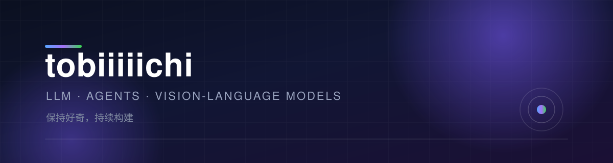

  

## 🧭 关于我

- 🔭 现在在做：持续打磨个人项目与身边的工具链
- 🌱 正在深入：软件测试自动化 · 工程质量 · 研发效率
- 🎯 关注方向：让软件更可靠，让流程更省力
- 💬 欢迎聊聊：技术、工具、测试与工程实践

## 🧰 工具箱

  
  
  
  
  
  
  
  

<!--
  上面这一排徽章按需增删，想加别的就复制一行改名字：
  https://img.shields.io/badge/显示的文本-背景色?style=flat-square&logo=图标名&logoColor=white
  图标名可以在 https://simpleicons.org 查。
-->

## 🚀 精选项目

> 📌 正在整理中，敬请期待。

<!--
  有拿得出手的仓库之后，把上面那句说明换成卡片，例如：

  ### [项目名](https://github.com/tobiiiiichi/项目名)
  一句话说明这个项目解决了什么问题。

  `Python` · `FastAPI` · `PostgreSQL`
-->

## 📮 联系我

  
  

<!--
  ── 以后想加 GitHub 数据卡片，把下面这段的注释去掉即可 ──

  ## 📊 GitHub 数据

  

    
    
  

  ── 注意：现在仓库还比较少，卡片数据会几乎全是 0，建议等有项目后再开 ──
-->

  Thanks for stopping by ✨

